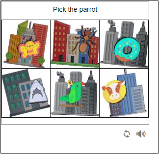

# FunCaptcha click

FunCaptcha là một loại hình ảnh xác thực phổ biến trông giống như thế này

<div>

<figure><figcaption></figcaption></figure>

 

<figure><figcaption></figcaption></figure>

 

<figure><figcaption></figcaption></figure>

 

<figure><figcaption></figcaption></figure>

</div>

* Extension chrome hỗ trợ lấy ảnh captcha : [Download](https://drive.google.com/drive/folders/18XhnFFNIpCBKqIEZo3CFOndMwy\_z8Dbm?usp=drive\_link)
* Extension chrome tự động giải FunCaptcha : [Download](https://drive.google.com/file/d/1ZJykXT1VkocTSLiIHd\_aibYzrpmHE5u4/view?usp=drive\_link)
* Project C# mẫu : [Download](https://drive.google.com/file/d/1sp5OIOqSgY3X\_vSLcnS3EHQrcT5L8yp9/view?usp=drive\_link) pass: omocaptcha.com

## 1.Tạo yêu cầu

### Request

**POST :** `https://omocaptcha.com/api/createJob`

<table><thead><tr><th width="199">Name</th><th width="88">Type</th><th width="112">Required</th><th>Description</th></tr></thead><tbody><tr><td>api_token</td><td>text</td><td>yes</td><td>Khóa tài khoản khách hàng</td></tr><tr><td>data.type_job_id</td><td>text</td><td>yes</td><td>Id dịch vụ captcha cần giải</td></tr><tr><td>data.image_base64</td><td>text</td><td>yes</td><td>Hình ảnh được mã hóa base64 <mark style="color:red;">(không phải ảnh chụp màn hình)</mark></td></tr><tr><td>data.text</td><td>text</td><td>yes</td><td>Văn bản câu hỏi captcha</td></tr></tbody></table>

```json
Host: omocaptcha.com
Content-Type: application/json

{
	"api_token": "YOUR_API_KEY",
	"data": {
		"type_job_id": "45",
		"image_base64": "image as base64 encoded",
		"text": "Use the arrows to pick the image where all the darts add up to the number in the left image"
	}
}
```

### Phản hồi



```json
{
	"error": false,
	"job_id": 123456,
	"message": "Create job success."
}
```

* Máy chủ sẽ trả về <mark style="color:blue;">`error= false`</mark> và <mark style="color:blue;">`job_id`</mark> thành công



```json
{
	"error": true,
	"message": "MESSAGE_ERROR",
}
```

* Máy chủ sẽ trả về <mark style="color:blue;">`error = true`</mark> và <mark style="color:blue;">`message`</mark> mô tả ngắn về trạng thái



## 2.Nhận kết quả yêu cầu

### Request

**POST :** `https://omocaptcha.com/api/getJobResult`

<table><thead><tr><th width="122">Name</th><th width="99">Type</th><th width="111"> Required</th><th width="412">Description</th></tr></thead><tbody><tr><td>api_token</td><td>text</td><td>yes</td><td>Khóa tài khoản khách hàng</td></tr><tr><td>job_id</td><td>number</td><td>yes</td><td>Id của job vừa tạo</td></tr></tbody></table>

<pre class="language-json"><code class="lang-json"><strong>Host: omocaptcha.com
</strong>Content-Type: application/json

{
	"api_token": "YOUR_API_KEY",
	"job_id": 123456
}
</code></pre>

### Phản hồi



```json
{
	"error": false,
	"status": "success",
	"result": "5"
}
```

* Máy chủ sẽ trả về <mark style="color:blue;">`error= false`</mark> và <mark style="color:blue;">`status = success`</mark>
* Đọc kết quả trong <mark style="color:blue;">`result`</mark>

<figure><figcaption></figcaption></figure>

* <mark style="color:red;">Lưu ý</mark>: Trong trường hợp captcha dạng này thì trên server sẽ trả về kết quả là vị trí của ảnh đúng và lúc bạn click vào nút bên phải bạn phải trừ đi một giá trị của kết quả server trả về bởi vì trên web ảnh của captcha đang ở vị trí thứ nhất, ví dụ server trả về kết quả là 5 thì bạn chỉ cần click vào nút bên phải 4 lần



```json
{
	"error": false,
	"status": "running",
	"result": null
}
```

* <mark style="color:blue;">`error= false`</mark> và <mark style="color:blue;">`status = running`</mark> yêu cầu đang được xử lý, xin vui lòng chờ 2 giây rồi yêu cầu lại



```json
{
	"error": false,
	"status": "fail",
	"result": null
}
```

* Máy chủ sẽ trả về <mark style="color:blue;">`error= false`</mark> và <mark style="color:blue;">`status = fail`</mark>



