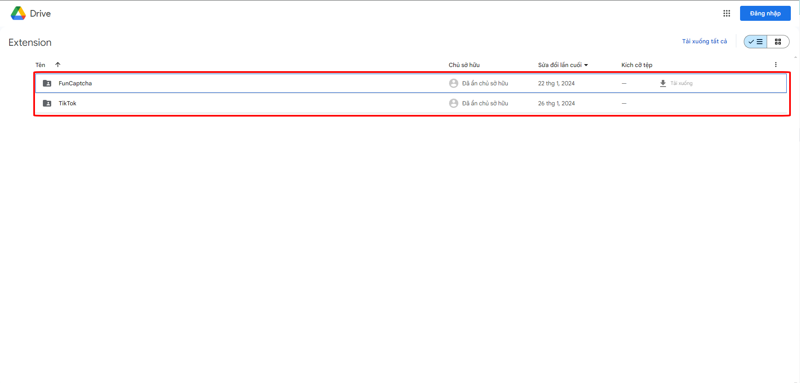

# Hướng dẫn cài extension

## 1.Tải extension

Bấm vào [đây](https://drive.google.com/drive/folders/18XhnFFNIpCBKqIEZo3CFOndMwy\_z8Dbm?usp=drive\_link) để đến thư mục chữa các extension

<figure><figcaption></figcaption></figure>

Sau khi đã truy cập thành công hãy chon một extension bạn muốn cài ở đây ví dụ chúng tôi muốn cài extension giải captcha FunCaptcha thì sẽ truy cập thư mục "FunCaptcha" trong thư mục sẽ chữa các file nén như thế này

<figure><figcaption></figcaption></figure>

Ở đây ta có thể thấy một file có đuôi "new" file này là extension phiên bản mới nhất chúng tôi sẽ tải file này xuống hoặc bạn có thể tải phiên bản khác cũng được nhưng chúng tôi khuyên bạn nên dùng bản mới nhất

## 2.Nhập api token vào trong extension

Sau khi tải thành công extension ở bước 1 chúng ta sẽ có file nén như này

<figure><figcaption></figcaption></figure>

Tiếp tục chúng ta giải nén file zip này ra nếu trong quá trình giải nén mà hiện thông báo nhập mật khẩu thì hãy nhập mật khẩu là <mark style="color:green;">12345</mark>&#x20;

<figure><figcaption></figcaption></figure>

Sau khi giải nén thành công thì chúng ta sẽ được thư mục như này&#x20;

<figure><figcaption></figcaption></figure>

Tiếp tục chúng ta sẽ truy cập vào thư mục vừa giải nén ra và tìm đến file "config.js"

<figure><figcaption></figcaption></figure>

Sau khi tìm thấy file "config.js" hãy mở file bằng công cụ trình soạn thảo văn bản trên máy tính của bạn ở đây chúng tôi dùng Notepad sau khi mở file "config.js" nó sẽ trông giống như thế này

<figure><figcaption></figcaption></figure>

Sau khi mở file "config.js" thành công chúng ta hãy để ý đến đoạn văn bản "YOU\_API\_TOKEN" đây là nơi chúng ta thêm api token của mình vào, bây giờ hãy vào trang quả trị của bạn trên trang web [OMOcaptcha.com](https://omocaptcha.com/home) và sao chép api token ở phần "**API Key của bạn**" xong vào quay lại file "config.js" rồi thay thế api token của bạn vào đoạn văn bản "YOU\_API\_TOKEN" rồi lưu lại, sau khi thêm api token vào file "config.js" nó sẽ trông giống như thế này&#x20;

<figure><figcaption></figcaption></figure>

## 2.Cài extension vào chrome

Sau khi thêm api token xong bây chúng tao hay mở chrrome lên rồi truy cập vào url này chrome://extensions/ sau khi truy cập thành công nó sẽ như thế này&#x20;

<figure><figcaption></figcaption></figure>

Hãy đê ý ở góc bên phải có nút "Chế độ dành cho nhà phát triển" nếu nó đang tắt thì hãy bật nó lên như này

<figure><figcaption></figcaption></figure>

Tếp tục bấm vào nút "Tải tiện ích đã giải nén"

<figure><figcaption></figcaption></figure>

Sau khi bấm vào nút "Tải tiện ích đã giải nén" sẽ hiện một tab chọn thư mục bây giờ hãy tìm đến thư mục extension mà đã giải nén và thêm api token ở bước 2

<figure><figcaption></figcaption></figure>

Tiếp tục ta bấm vào nút "Select Foleder" để chọn thư mục đó sau khi chọn xong ở trong trình duyệt sẽ hiện như thế này là chúng ta đã cài extension thành công

<figure><figcaption></figcaption></figure>
