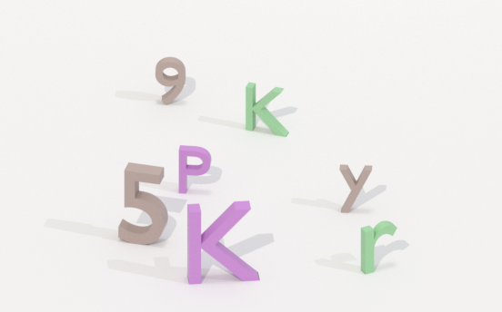

# Chon 2 đối tượng trên web

Chon 2 đối tượng trên web là một loại hình ảnh xác thực phổ biến trông giống như thế này

<figure><figcaption></figcaption></figure>

## 1.Tạo yêu cầu

### Request

**POST :** `https://omocaptcha.com/api/createJob`

<table><thead><tr><th width="228">Name</th><th width="92">Type</th><th width="104">Required</th><th>Description</th></tr></thead><tbody><tr><td>api_token</td><td>text</td><td>yes</td><td>Khóa tài khoản khách hàng</td></tr><tr><td>data.type_job_id</td><td>text</td><td>yes</td><td>Id dịch vụ captcha cần giải</td></tr><tr><td>data.image_base64</td><td>text</td><td>yes</td><td>Hình ảnh được mã hóa base64</td></tr><tr><td>data.width_view</td><td>number</td><td>yes</td><td>Chiều rộng ảnh hiển thị trên web</td></tr><tr><td>data.height_view</td><td>number</td><td>yes</td><td>Chiều cao ảnh hiển thị trên web</td></tr></tbody></table>

```json
Host: omocaptcha.com
Content-Type: application/json

{
	"api_token": "YOUR_API_KEY",
	"data": {
		"type_job_id": "22",
		"image_base64": "Image as base64 encoded",
		"width_view": 340,
		"height_view": 212
	}
}
```

### Phản hồi



```json
{
	"error": false,
	"job_id": 123456,
	"message": "Create job success."
}
```

* Máy chủ sẽ trả về <mark style="color:blue;">`error= false`</mark> và <mark style="color:blue;">`job_id`</mark> thành công



```json
{
	"error": true,
	"message": "MESSAGE_ERROR",
}
```

* Máy chủ sẽ trả về <mark style="color:blue;">`error = true`</mark> và <mark style="color:blue;">`message`</mark> mô tả ngắn về trạng thái



## 2.Nhận kết quả yêu cầu

### Request

**POST :** `https://omocaptcha.com/api/getJobResult`

<table><thead><tr><th width="122">Name</th><th width="99">Type</th><th width="111"> Required</th><th width="412">Description</th></tr></thead><tbody><tr><td>api_token</td><td>text</td><td>yes</td><td>Khóa tài khoản khách hàng</td></tr><tr><td>job_id</td><td>number</td><td>yes</td><td>Id của job vừa tạo</td></tr></tbody></table>

```json
Host: omocaptcha.com
Content-Type: application/json

{
	"api_token": "YOUR_API_KEY",
	"job_id": 123456
}
```

### Phản hồi



```json
{
	"error": false,
	"status": "success",
	"result": "x1|y1|x2|y2"
}
```

* Máy chủ sẽ trả về <mark style="color:blue;">`error = false`</mark> và <mark style="color:blue;">`status = success`</mark>
* Đọc kết quả trong <mark style="color:blue;">`result`</mark>
* Kết quả trả về sẽ là toà độ cần click trên ảnh

### Mã mẫu javascript click captcha

```javascript
function simulateClick(element, offsetX, offsetY) {
    var rect = element.getBoundingClientRect();
    var clientX = rect.left + offsetX;
    var clientY = rect.top + offsetY;
    var clickEvent = new MouseEvent('click', { bubbles: true, clientX: clientX, clientY: clientY });
    element.dispatchEvent(clickEvent);
}

var imageCaptcha = document.querySelector("#captcha-verify-image");
var x1 = 12;
var y1 = 12;
var x2 = 12;
var y2 = 12;
simulateClick(imageCaptcha, x1, y1);
simulateClick(imageCaptcha, x2, y2);

document.querySelector('div[class*="verify-captcha-submit-button submit-button"]').click();
```



```json
{
	"error": false,
	"status": "running",
	"result": ""
}
```

* <mark style="color:blue;">`error = false`</mark> và <mark style="color:blue;">`status = running`</mark> yêu cầu đang được xử lý, xin vui lòng chờ 2 giây rồi yêu cầu lại



```json
{
	"error": false,
	"status": "fail",
	"result": ""
}
```

* Máy chủ sẽ trả về <mark style="color:blue;">`error = false`</mark> và <mark style="color:blue;">`status = fail`</mark>



##
