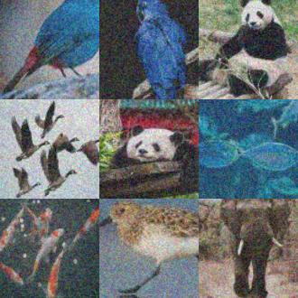

# Coinmarketcap


Coinmarketcap là một loại hình ảnh xác thực phổ biến trông giống như thế này

<figure><figcaption></figcaption></figure>

## 1.Tạo yêu cầu

### Request

**POST :** `https://omocaptcha.com/api/createJob`

| Name               | Type | Required | Description                                                                                                 |
| ------------------ | ---- | -------- | ----------------------------------------------------------------------------------------------------------- |
| api\_token         | text | yes      | Khóa tài khoản khách hàng                                                                                   |
| data.type\_job\_id | text | yes      | Id dịch vụ captcha cần giải                                                                                 |
| data.input         | text | yes      | Văn bản để nhận diện đối tượng  |
| data.image\_base64 | text | yes      | Hình ảnh được mã hóa base64                        |

```json
POST /createTask HTTP/1.1
Host: omocaptcha.com
Content-Type: application/json

{
	"api_token": "YOUR_API_KEY",
	"data": {
		"type_job_id": "14",
		"input": "panda",
		"image_base64": "iVBORw0KGgoAAAANSUhEUgAAAcwAAAHMC......"
	}
}
```

<mark style="color:red;">Lưu ý :</mark> Văn bản để nhận diện đối tượng chỉ hỗ trợ ngôn ngữ tiếng anh và tiếng việt

### Phản hồi



```json
{
	"error": false,
	"job_id": 123456,
	"message": "Create job success."
}
```

* Máy chủ sẽ trả về <mark style="color:blue;">`error= false`</mark> và <mark style="color:blue;">`job_id`</mark> <mark style="color:blue;"></mark><mark style="color:blue;"></mark> thành công



```json
{
	"error": true,
	"message": "MESSAGE_ERROR",
}
```

* Máy chủ sẽ trả về <mark style="color:blue;">`error = true`</mark> và <mark style="color:blue;">`message`</mark> mô tả ngắn về trạng thái



## 2.Nhận kết quả yêu cầu

### Request

**POST :** `https://omocaptcha.com/api/getJobResult`

| Name       | Type   |  Required | Description               |
| ---------- | ------ | --------- | ------------------------- |
| api\_token | text   | yes       | Khóa tài khoản khách hàng |
| job\_id    | number | yes       | Id của job vừa tạo        |

```json
POST /getTaskResult HTTP/1.1
Host: omocaptcha.com
Content-Type: application/json

{
	"api_token": "YOUR_API_KEY",
	"job_id": 123456
}
```

### Phản hồi



```json
{
	"error": false,
	"status": "success",
	"result":{
		    "index|index|index"
	 }
}
```

* Máy chủ sẽ trả về <mark style="color:blue;">`error = false`</mark> và <mark style="color:blue;">`status = success`</mark>
* Đọc kết quả trong <mark style="color:blue;">`result`</mark>
* <mark style="color:blue;">`index`</mark> là số thứ tự để click ví du số 1 là ảnh số 1


