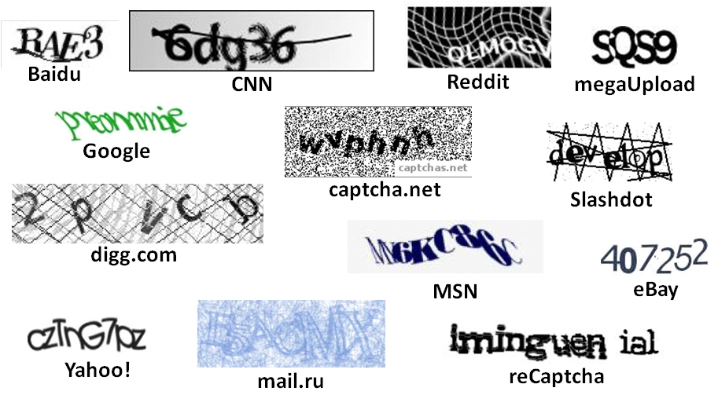

# Hình ảnh thành văn bản

Captcha thông thường là một hình ảnh có chứa văn bản bị bóp méo nhưng con người có thể đọc được. Để giải quyết hình ảnh xác thực, người dùng phải nhập văn bản từ hình ảnh. trông giống như những hình ảnh dưới đây

<figure><figcaption><p>1.Ảnh captcha văn bản</p></figcaption></figure>

## 1.Tạo yêu cầu

### Request

**POST :** `https://omocaptcha.com/api/createJob`

| Name               | Type | Required | Description                 |
| ------------------ | ---- | -------- | --------------------------- |
| api\_token         | text | yes      | Khóa tài khoản khách hàng   |
| data.type\_job\_id | text | yes      | Id dịch vụ captcha cần giải |
| data.image\_base64 | text | yes      | Hình ảnh được mã hóa base64 |

```json
POST /createTask HTTP/1.1
Host: omocaptcha.com
Content-Type: application/json

{
	"api_token": "YOUR_API_KEY",
	"data": {
		"type_job_id": "30",
		"image_base64": "image as base64 encoded"
	}
}
```

### Phản hồi



```json
{
	"error": false,
	"job_id": 123456,
	"message": "Create job success."
}
```

* Máy chủ sẽ trả về <mark style="color:blue;">`error= false`</mark> và <mark style="color:blue;">`job_id`</mark> <mark style="color:blue;"></mark><mark style="color:blue;"></mark> thành công



```json
{
	"error": true,
	"message": "MESSAGE_ERROR",
}
```

* Máy chủ sẽ trả về <mark style="color:blue;">`error = true`</mark> và <mark style="color:blue;">`message`</mark> mô tả ngắn về trạng thái



## 2.Nhận kết quả yêu cầu

### Request

**POST :** `https://omocaptcha.com/api/getJobResult`

| Name       | Type   |  Required | Description               |
| ---------- | ------ | --------- | ------------------------- |
| api\_token | text   | yes       | Khóa tài khoản khách hàng |
| job\_id    | number | yes       | Id của job vừa tạo        |

```json
POST /getTaskResult HTTP/1.1
Host: omocaptcha.com
Content-Type: application/json

{
	"api_token": "YOUR_API_KEY",
	"job_id": 123456
}
```

### Phản hồi



```json
{
	"error": false,
	"status": "success",
	"result": "abcxyz"
}
```

* Máy chủ sẽ trả về <mark style="color:blue;">`error= false`</mark> và <mark style="color:blue;">`status = success`</mark>
* Đọc kết quả trong <mark style="color:blue;">`result`</mark>



```json
{
	"error": false,
	"status": "running",
	"result": null
}
```

* <mark style="color:blue;">`error= false`</mark> và <mark style="color:blue;">`status = running`</mark> yêu cầu đang được xử lý, xin vui lòng chờ 2 giây rồi yêu cầu lại



```json
{
	"error": false,
	"status": "fail",
	"result": null
}
```

* Máy chủ sẽ trả về <mark style="color:blue;"></mark> <mark style="color:blue;"></mark><mark style="color:blue;">`error= false`</mark> và <mark style="color:blue;">`status = fail`</mark>



