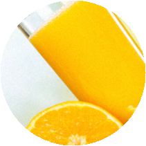

# Tiktok

Captcha tiktok là một loại hình ảnh xác thực phổ biến trông giống như thế này

<div>

<figure><figcaption><p>1.Ảnh captcha tiktok</p></figcaption></figure>

 

<figure><figcaption><p>2.Ảnh captcha tiktok</p></figcaption></figure>

</div>

## Chọn 2 đối tượng có hình dạng giống nhau trên web

<figure><figcaption></figcaption></figure>

### 1.Tạo yêu cầu

#### Request

**POST :** `https://omocaptcha.com/api/createJob`

| Name               | Type   | Required | Description                                                                                               |
| ------------------ | ------ | -------- | --------------------------------------------------------------------------------------------------------- |
| api\_token         | text   | yes      | Khóa tài khoản khách hàng                                                                                 |
| data.type\_job\_id | text   | yes      | Id dịch vụ captcha cần giải                                                                               |
| data.image\_base64 | text   | yes      | Hình ảnh được mã hóa base64 |
| data.widthview     | number | yes      | Chiều rộng ảnh hiển thị trên web (2).png>)                 |
| data.weightview    | number | yes      | Chiều cao ảnh hiển thị trên web.png>)                      |

```json
POST /createTask HTTP/1.1
Host: api.anycaptcha.com
Content-Type: application/json

{
	"api_token": "YOUR_API_KEY",
	"data": {
		"type_job_id": "ID",
		"image_base64": "image as base64 encoded",
		"widthview": "340",
		"weightview": "212"
	}
}
```

#### Phản hồi



```json
{
	"error": false,
	"job_id": 123456,
	"message": "Create job success."
}
```

* Máy chủ sẽ trả về <mark style="color:blue;">`error= false`</mark> và <mark style="color:blue;">`job_id`</mark> <mark style="color:blue;"></mark><mark style="color:blue;"></mark> thành công



```json
{
	"error": true,
	"message": "MESSAGE_ERROR",
}
```

* Máy chủ sẽ trả về <mark style="color:blue;">`error = true`</mark> và <mark style="color:blue;">`message`</mark> mô tả ngắn về trạng thái



### 2.Nhận kết quả yêu cầu

#### Request

**POST :** `https://omocaptcha.com/api/getJobResult`

| Name       | Type   |  Required | Description               |
| ---------- | ------ | --------- | ------------------------- |
| api\_token | text   | yes       | Khóa tài khoản khách hàng |
| job\_id    | number | yes       | Id của job vừa tạo        |

```json
POST /getTaskResult HTTP/1.1
Host: omocaptcha.com
Content-Type: application/json

{
	"api_token": "YOUR_API_KEY",
	"job_id": 123456
}
```

#### Phản hồi



```json
{
	"error": false,
	"status": "success",
	"result": "x1_y1_x2_y2"
}
```

* Máy chủ sẽ trả về <mark style="color:blue;">`error = false`</mark> và <mark style="color:blue;">`status = success`</mark>
* Đọc kết quả trong <mark style="color:blue;">`result`</mark>



```json
{
	"error": false,
	"status": "running",
	"result": null
}
```

* <mark style="color:blue;">`error = false`</mark> và <mark style="color:blue;">`status = running`</mark> yêu cầu đang được xử lý, xin vui lòng chờ 2 giây rồi yêu cầu lại



```json
{
	"error": false,
	"status": "fail",
	"result": null
}
```

* Máy chủ sẽ trả về <mark style="color:blue;"></mark> <mark style="color:blue;"></mark><mark style="color:blue;">`error = false`</mark> và <mark style="color:blue;">`status = fail`</mark>



## Chọn 2 đối tượng có hình dạng giống nhau trên phone

<figure><figcaption></figcaption></figure>

### 1.Tạo yêu cầu

#### Request

**POST :** `https://omocaptcha.com/api/createJob`

| Name               | Type | Required | Description                                                                                                          |
| ------------------ | ---- | -------- | -------------------------------------------------------------------------------------------------------------------- |
| api\_token         | text | yes      | Khóa tài khoản khách hàng                                                                                            |
| data.type\_job\_id | text | yes      | Id dịch vụ captcha cần giải                                                                                          |
| data.image\_base64 | text | yes      | Hình ảnh chụp màn hình được mã hóa base64 |

```json
POST /createTask HTTP/1.1
Host: api.anycaptcha.com
Content-Type: application/json

{
	"api_token": "YOUR_API_KEY",
	"data": {
		"type_job_id": "ID",
		"image_base64": "image as base64 encoded",
	 }
}
```

#### Phản hồi



```json
{
	"error": false,
	"job_id": 123456,
	"message": "Create job success."
}
```

* Máy chủ sẽ trả về <mark style="color:blue;">`error= false`</mark> và <mark style="color:blue;">`job_id`</mark> <mark style="color:blue;"></mark><mark style="color:blue;"></mark> thành công



```json
{
	"errorId": 0,
	"taskId": 123456
}
```

* Máy chủ sẽ trả về <mark style="color:blue;">`error = true`</mark> và <mark style="color:blue;">`message`</mark> mô tả ngắn về trạng thái



### 2.Nhận kết quả yêu cầu

#### Request

**POST :** `https://omocaptcha.com/api/getJobResult`

| Name       | Type   |  Required | Description               |
| ---------- | ------ | --------- | ------------------------- |
| api\_token | text   | yes       | Khóa tài khoản khách hàng |
| job\_id    | number | yes       | Id của job vừa tạo        |

```json
POST /getTaskResult HTTP/1.1
Host: omocaptcha.com
Content-Type: application/json

{
	"api_token": "YOUR_API_KEY",
	"job_id": 123456
}
```

#### Phản hồi



```json
{
	"error": false,
	"status": "success",
	"result": "x1_y1_x2_y2"
}
```

* Máy chủ sẽ trả về <mark style="color:blue;">`error = false`</mark> và <mark style="color:blue;">`status = success`</mark>
* Đọc kết quả trong <mark style="color:blue;">`result`</mark>



```json
{
	"error": false,
	"status": "running",
	"result": null
}
```

* <mark style="color:blue;">`error= false`</mark> và <mark style="color:blue;">`status = running`</mark> yêu cầu đang được xử lý, xin vui lòng chờ 2 giây rồi yêu cầu lại



```json
{
	"error": false,
	"status": "fail",
	"result": null
}
```

* Máy chủ sẽ trả về <mark style="color:blue;"></mark> <mark style="color:blue;"></mark><mark style="color:blue;">`error= false`</mark> và <mark style="color:blue;">`status = fail`</mark>



## Loại xoay trên web

<figure><figcaption></figcaption></figure>


### 1.Tạo yêu cầu

#### Request

**POST :** `https://omocaptcha.com/api/createJob`

| Name                | Type | Required | Description                           |
| ------------------- | ---- | -------- | ------------------------------------- |
| api\_token          | text | yes      | Khóa tài khoản khách hàng             |
| data.type\_job\_id  | text | yes      | Id dịch vụ captcha cần giải           |
| data.image\_base64  | text | yes      | Hình ảnh bên trong được mã hóa base64 |

<div>

<figure><figcaption><p><strong>Ảnh bên trong</strong></p></figcaption></figure>

 

<figure><figcaption><p><strong>Ảnh bên ngoài</strong></p></figcaption></figure>

</div>

<pre class="language-json"><code class="lang-json">POST /createTask HTTP/1.1
Host: api.anycaptcha.com
Content-Type: application/json

{
	"api_token": "YOUR_API_KEY",
	"data": {
		"type_job_id": "ID",
<strong>		"image_base64 ":"Ảnh bên trong | Ảnh bên ngoài"
</strong>	 }
}</code></pre>

<mark style="color:red;">Lưu ý</mark> : Hai chuỗi base64 được ngăn cách băng ký tự '|'

#### Phản hồi



```json
{
	"error": false,
	"job_id": 123456,
	"message": "Create job success."
}
```

* Máy chủ sẽ trả về <mark style="color:blue;">`error= false`</mark> và <mark style="color:blue;">`job_id`</mark> <mark style="color:blue;"></mark><mark style="color:blue;"></mark> thành công



```json
{
	"error": true,
	"message": "MESSAGE_ERROR",
}
```

* Máy chủ sẽ trả về <mark style="color:blue;">`error = true`</mark> và <mark style="color:blue;">`message`</mark> mô tả ngắn về trạng thái



### 2.Nhận kết quả yêu cầu

#### Request

**POST :** `https://omocaptcha.com/api/getJobResult`

| Name       | Type   |  Required | Description               |
| ---------- | ------ | --------- | ------------------------- |
| api\_token | text   | yes       | Khóa tài khoản khách hàng |
| job\_id    | number | yes       | Id của job vừa tạo        |

```json
POST /getTaskResult HTTP/1.1
Host: omocaptcha.com
Content-Type: application/json

{
	"api_token": "YOUR_API_KEY",
	"job_id": 123456
}
```

#### Phản hồi



```json
{
	"error": false,
	"status": "success",
	"result": "50"
}
```

* Máy chủ sẽ trả về <mark style="color:blue;">`error = false`</mark> và <mark style="color:blue;">`status = success`</mark>
* Đọc kết quả trong <mark style="color:blue;">`result`</mark>



```json
{
	"error": false,
	"status": "running",
	"result": null
}
```

* <mark style="color:blue;">`error= false`</mark> và <mark style="color:blue;">`status = running`</mark> yêu cầu đang được xử lý, xin vui lòng chờ 2 giây rồi yêu cầu lại



```json
{
	"error": false,
	"status": "fail",
	"result": null
}
```

* Máy chủ sẽ trả về <mark style="color:blue;"></mark> <mark style="color:blue;"></mark><mark style="color:blue;">`error= false`</mark> và <mark style="color:blue;">`status = fail`</mark>


