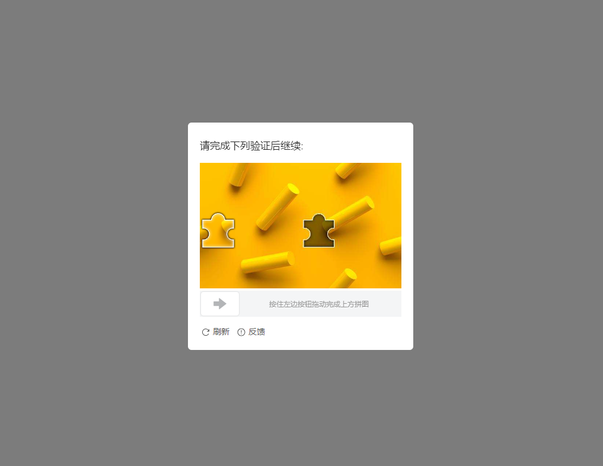

# Tiktok

Captcha tiktok là một loại hình ảnh xác thực phổ biến trông giống như thế này

<div>

<figure><figcaption><p>1.Ảnh captcha tiktok</p></figcaption></figure>

 

<figure><figcaption><p>2.Ảnh captcha tiktok</p></figcaption></figure>

</div>

## Chọn 2 đối tượng có hình dạng giống nhau trên web

<figure><figcaption></figcaption></figure>

### 1.Tạo yêu cầu

#### Request

**POST :** `https://omocaptcha.com/api/createJob`

<table><thead><tr><th width="228">Name</th><th width="92">Type</th><th width="104">Required</th><th>Description</th></tr></thead><tbody><tr><td>api_token</td><td>text</td><td>yes</td><td>Khóa tài khoản khách hàng</td></tr><tr><td>data.type_job_id</td><td>text</td><td>yes</td><td>Id dịch vụ captcha cần giải</td></tr><tr><td>data.image_base64</td><td>text</td><td>yes</td><td>Hình ảnh được mã hóa base64</td></tr><tr><td>data.width_view</td><td>number</td><td>yes</td><td>Chiều rộng ảnh hiển thị trên web</td></tr><tr><td>data.height_view</td><td>number</td><td>yes</td><td>Chiều cao ảnh hiển thị trên web</td></tr></tbody></table>

```json
POST /createTask HTTP/1.1
Host: omocaptcha.com
Content-Type: application/json

{
	"api_token": "YOUR_API_KEY",
	"data": {
		"type_job_id": "ID",
		"image_base64": "image as base64 encoded",
		"width_view": 340,
		"height_view": 212
	}
}
```

#### Phản hồi



```json
{
	"error": false,
	"job_id": 123456,
	"message": "Create job success."
}
```

* Máy chủ sẽ trả về <mark style="color:blue;">`error= false`</mark> và <mark style="color:blue;">`job_id`</mark> thành công



```json
{
	"error": true,
	"message": "MESSAGE_ERROR",
}
```

* Máy chủ sẽ trả về <mark style="color:blue;">`error = true`</mark> và <mark style="color:blue;">`message`</mark> mô tả ngắn về trạng thái



### 2.Nhận kết quả yêu cầu

#### Request

**POST :** `https://omocaptcha.com/api/getJobResult`

<table><thead><tr><th width="122">Name</th><th width="99">Type</th><th width="111"> Required</th><th width="412">Description</th></tr></thead><tbody><tr><td>api_token</td><td>text</td><td>yes</td><td>Khóa tài khoản khách hàng</td></tr><tr><td>job_id</td><td>number</td><td>yes</td><td>Id của job vừa tạo</td></tr></tbody></table>

```json
POST /getTaskResult HTTP/1.1
Host: omocaptcha.com
Content-Type: application/json

{
	"api_token": "YOUR_API_KEY",
	"job_id": 123456
}
```

#### Phản hồi



```json
{
	"error": false,
	"status": "success",
	"result": "x1|y1|x2|y2"
}
```

* Máy chủ sẽ trả về <mark style="color:blue;">`error = false`</mark> và <mark style="color:blue;">`status = success`</mark>
* Đọc kết quả trong <mark style="color:blue;">`result`</mark>



```json
{
	"error": false,
	"status": "running",
	"result": null
}
```

* <mark style="color:blue;">`error = false`</mark> và <mark style="color:blue;">`status = running`</mark> yêu cầu đang được xử lý, xin vui lòng chờ 2 giây rồi yêu cầu lại



```json
{
	"error": false,
	"status": "fail",
	"result": null
}
```

* Máy chủ sẽ trả về <mark style="color:blue;">`error = false`</mark> và <mark style="color:blue;">`status = fail`</mark>



## Chọn 2 đối tượng có hình dạng giống nhau trên phone

<figure><figcaption></figcaption></figure>

### 1.Tạo yêu cầu

#### Request

**POST :** `https://omocaptcha.com/api/createJob`

<table><thead><tr><th width="199">Name</th><th width="92">Type</th><th width="104">Required</th><th>Description</th></tr></thead><tbody><tr><td>api_token</td><td>text</td><td>yes</td><td>Khóa tài khoản khách hàng</td></tr><tr><td>data.type_job_id</td><td>text</td><td>yes</td><td>Id dịch vụ captcha cần giải</td></tr><tr><td>data.image_base64</td><td>text</td><td>yes</td><td>Hình ảnh chụp màn hình được mã hóa base64</td></tr></tbody></table>

```json
POST /createTask HTTP/1.1
Host: omocaptcha.com
Content-Type: application/json

{
	"api_token": "YOUR_API_KEY",
	"data": {
		"type_job_id": "ID",
		"image_base64": "image as base64 encoded"
	 }
}
```

#### Phản hồi



```json
{
	"error": false,
	"job_id": 123456,
	"message": "Create job success."
}
```

* Máy chủ sẽ trả về <mark style="color:blue;">`error= false`</mark> và <mark style="color:blue;">`job_id`</mark> thành công



```json
{
	"errorId": 0,
	"taskId": 123456
}
```

* Máy chủ sẽ trả về <mark style="color:blue;">`error = true`</mark> và <mark style="color:blue;">`message`</mark> mô tả ngắn về trạng thái



### 2.Nhận kết quả yêu cầu

#### Request

**POST :** `https://omocaptcha.com/api/getJobResult`

<table><thead><tr><th width="122">Name</th><th width="99">Type</th><th width="111"> Required</th><th width="412">Description</th></tr></thead><tbody><tr><td>api_token</td><td>text</td><td>yes</td><td>Khóa tài khoản khách hàng</td></tr><tr><td>job_id</td><td>number</td><td>yes</td><td>Id của job vừa tạo</td></tr></tbody></table>

```json
POST /getTaskResult HTTP/1.1
Host: omocaptcha.com
Content-Type: application/json

{
	"api_token": "YOUR_API_KEY",
	"job_id": 123456
}
```

#### Phản hồi



```json
{
	"error": false,
	"status": "success",
	"result": "x1|y1|x2|y2"
}
```

* Máy chủ sẽ trả về <mark style="color:blue;">`error = false`</mark> và <mark style="color:blue;">`status = success`</mark>
* Đọc kết quả trong <mark style="color:blue;">`result`</mark>



```json
{
	"error": false,
	"status": "running",
	"result": null
}
```

* <mark style="color:blue;">`error= false`</mark> và <mark style="color:blue;">`status = running`</mark> yêu cầu đang được xử lý, xin vui lòng chờ 2 giây rồi yêu cầu lại



```json
{
	"error": false,
	"status": "fail",
	"result": null
}
```

* Máy chủ sẽ trả về <mark style="color:blue;">`error= false`</mark> và <mark style="color:blue;">`status = fail`</mark>



## Loại xoay trên web

<figure><figcaption></figcaption></figure>


### 1.Tạo yêu cầu

#### Request

**POST :** `https://omocaptcha.com/api/createJob`

<table><thead><tr><th width="202">Name</th><th width="92">Type</th><th width="104">Required</th><th>Description</th></tr></thead><tbody><tr><td>api_token</td><td>text</td><td>yes</td><td>Khóa tài khoản khách hàng</td></tr><tr><td>data.type_job_id</td><td>text</td><td>yes</td><td>Id dịch vụ captcha cần giải</td></tr><tr><td>data.image_base64 </td><td>text</td><td>yes</td><td>Hình ảnh bên trong được mã hóa base64</td></tr></tbody></table>

<div align="left">

<figure><figcaption><p><strong>Ảnh bên trong</strong></p></figcaption></figure>

 

<figure><figcaption><p><strong>Ảnh bên ngoài</strong></p></figcaption></figure>

</div>

<pre class="language-json"><code class="lang-json">POST /createTask HTTP/1.1
Host: omocaptcha.com
Content-Type: application/json

{
	"api_token": "YOUR_API_KEY",
	"data": {
		"type_job_id": "ID",
<strong>		"image_base64":"Ảnh_bên_trong|Ảnh_bên_ngoài"
</strong>	 }
}
</code></pre>

<mark style="color:red;">Lưu ý</mark> : Hai chuỗi base64 được ngăn cách băng ký tự '|'

#### Phản hồi



```json
{
	"error": false,
	"job_id": 123456,
	"message": "Create job success."
}
```

* Máy chủ sẽ trả về <mark style="color:blue;">`error= false`</mark> và <mark style="color:blue;">`job_id`</mark> thành công



```json
{
	"error": true,
	"message": "MESSAGE_ERROR",
}
```

* Máy chủ sẽ trả về <mark style="color:blue;">`error = true`</mark> và <mark style="color:blue;">`message`</mark> mô tả ngắn về trạng thái



### 2.Nhận kết quả yêu cầu

#### Request

**POST :** `https://omocaptcha.com/api/getJobResult`

<table><thead><tr><th width="122">Name</th><th width="99">Type</th><th width="111"> Required</th><th width="412">Description</th></tr></thead><tbody><tr><td>api_token</td><td>text</td><td>yes</td><td>Khóa tài khoản khách hàng</td></tr><tr><td>job_id</td><td>number</td><td>yes</td><td>Id của job vừa tạo</td></tr></tbody></table>

```json
POST /getTaskResult HTTP/1.1
Host: omocaptcha.com
Content-Type: application/json

{
	"api_token": "YOUR_API_KEY",
	"job_id": 123456
}
```

#### Phản hồi



```json
{
	"error": false,
	"status": "success",
	"result": "50"
}
```

* Máy chủ sẽ trả về <mark style="color:blue;">`error = false`</mark> và <mark style="color:blue;">`status = success`</mark>
* Đọc kết quả trong <mark style="color:blue;">`result`</mark>



```json
{
	"error": false,
	"status": "running",
	"result": null
}
```

* <mark style="color:blue;">`error= false`</mark> và <mark style="color:blue;">`status = running`</mark> yêu cầu đang được xử lý, xin vui lòng chờ 2 giây rồi yêu cầu lại



```json
{
	"error": false,
	"status": "fail",
	"result": null
}
```

* Máy chủ sẽ trả về <mark style="color:blue;">`error= false`</mark> và <mark style="color:blue;">`status = fail`</mark>



## Kéo thả trên web

<figure><figcaption></figcaption></figure>

### 1.Tạo yêu cầu

#### Request

**POST :** `https://omocaptcha.com/api/createJob`

<table><thead><tr><th width="323">Name</th><th width="92">Type</th><th width="104">Required</th><th>Description</th></tr></thead><tbody><tr><td>api_token</td><td>text</td><td>yes</td><td>Khóa tài khoản khách hàng</td></tr><tr><td>data.type_job_id</td><td>text</td><td>yes</td><td>Id dịch vụ captcha cần giải</td></tr><tr><td>data.image_base64</td><td>text</td><td>yes</td><td>Hình ảnh chụp màn hình được mã hóa base64<br></td></tr><tr><td>data.width_view</td><td>number</td><td>yes</td><td>Chiều rộng ảnh hiển thị trên web<br><br></td></tr></tbody></table>

```json
POST /createTask HTTP/1.1
Host: omocaptcha.com
Content-Type: application/json

{
	"api_token": "YOUR_API_KEY",
	"data": {
		"type_job_id": "24",
		"image_base64": "image as base64 encoded",
		"width_view": 340
	 }
}
```

#### Phản hồi



```json
{
	"error": false,
	"job_id": 123456,
	"message": "Create job success."
}
```

* Máy chủ sẽ trả về <mark style="color:blue;">`error= false`</mark> và <mark style="color:blue;">`job_id`</mark> thành công



```json
{
	"errorId": 0,
	"taskId": 123456
}
```

* Máy chủ sẽ trả về <mark style="color:blue;">`error = true`</mark> và <mark style="color:blue;">`message`</mark> mô tả ngắn về trạng thái



### 2.Nhận kết quả yêu cầu

#### Request

**POST :** `https://omocaptcha.com/api/getJobResult`

<table><thead><tr><th width="122">Name</th><th width="99">Type</th><th width="111"> Required</th><th width="412">Description</th></tr></thead><tbody><tr><td>api_token</td><td>text</td><td>yes</td><td>Khóa tài khoản khách hàng</td></tr><tr><td>job_id</td><td>number</td><td>yes</td><td>Id của job vừa tạo</td></tr></tbody></table>

```json
POST /getTaskResult HTTP/1.1
Host: omocaptcha.com
Content-Type: application/json

{
	"api_token": "YOUR_API_KEY",
	"job_id": 123456
}
```

#### Phản hồi



```json
{
	"error": false,
	"status": "success",
	"result": "50"
}
```

* Máy chủ sẽ trả về <mark style="color:blue;">`error = false`</mark> và <mark style="color:blue;">`status = success`</mark>
* Đọc kết quả trong <mark style="color:blue;">`result`</mark>
* Sau khi nhận được kết quả hãy kéo thanh trượt theo kết quả nhận được



```json
{
	"error": false,
	"status": "running",
	"result": null
}
```

* <mark style="color:blue;">`error= false`</mark> và <mark style="color:blue;">`status = running`</mark> yêu cầu đang được xử lý, xin vui lòng chờ 2 giây rồi yêu cầu lại



```json
{
	"error": false,
	"status": "fail",
	"result": null
}
```

* Máy chủ sẽ trả về <mark style="color:blue;">`error= false`</mark> và <mark style="color:blue;">`status = fail`</mark>



## Kéo thả trên phone

<figure><figcaption></figcaption></figure>

### 1.Tạo yêu cầu

#### Request

**POST :** `https://omocaptcha.com/api/createJob`

<table><thead><tr><th width="323">Name</th><th width="92">Type</th><th width="104">Required</th><th>Description</th></tr></thead><tbody><tr><td>api_token</td><td>text</td><td>yes</td><td>Khóa tài khoản khách hàng</td></tr><tr><td>data.type_job_id</td><td>text</td><td>yes</td><td>Id dịch vụ captcha cần giải</td></tr><tr><td>data.image_base64</td><td>text</td><td>yes</td><td>Hình ảnh chụp màn hình được mã hóa base64</td></tr></tbody></table>

```json
POST /createTask HTTP/1.1
Host: omocaptcha.com
Content-Type: application/json

{
	"api_token": "YOUR_API_KEY",
	"data": {
		"type_job_id": "24",
		"image_base64": "image as base64 encoded"
	 }
}
```

#### Phản hồi



```json
{
	"error": false,
	"job_id": 123456,
	"message": "Create job success."
}
```

* Máy chủ sẽ trả về <mark style="color:blue;">`error= false`</mark> và <mark style="color:blue;">`job_id`</mark> thành công



```json
{
	"errorId": 0,
	"taskId": 123456
}
```

* Máy chủ sẽ trả về <mark style="color:blue;">`error = true`</mark> và <mark style="color:blue;">`message`</mark> mô tả ngắn về trạng thái



### 2.Nhận kết quả yêu cầu

#### Request

**POST :** `https://omocaptcha.com/api/getJobResult`

<table><thead><tr><th width="122">Name</th><th width="99">Type</th><th width="111"> Required</th><th width="412">Description</th></tr></thead><tbody><tr><td>api_token</td><td>text</td><td>yes</td><td>Khóa tài khoản khách hàng</td></tr><tr><td>job_id</td><td>number</td><td>yes</td><td>Id của job vừa tạo</td></tr></tbody></table>

```json
POST /getTaskResult HTTP/1.1
Host: omocaptcha.com
Content-Type: application/json

{
	"api_token": "YOUR_API_KEY",
	"job_id": 123456
}
```

#### Phản hồi



```json
{
	"error": false,
	"status": "success",
	"result": "x1|y1|x2|y2"
}
```

* Máy chủ sẽ trả về <mark style="color:blue;">`error = false`</mark> và <mark style="color:blue;">`status = success`</mark>
* Đọc kết quả trong <mark style="color:blue;">`result`</mark>



```json
{
	"error": false,
	"status": "running",
	"result": null
}
```

* <mark style="color:blue;">`error= false`</mark> và <mark style="color:blue;">`status = running`</mark> yêu cầu đang được xử lý, xin vui lòng chờ 2 giây rồi yêu cầu lại



```json
{
	"error": false,
	"status": "fail",
	"result": null
}
```

* Máy chủ sẽ trả về <mark style="color:blue;">`error= false`</mark> và <mark style="color:blue;">`status = fail`</mark>


