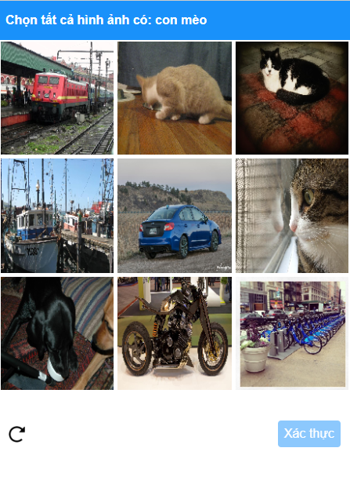
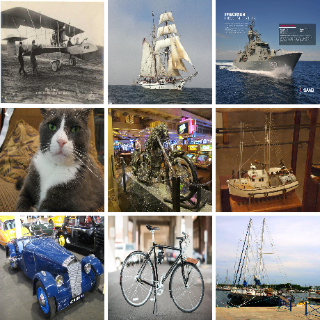

# ZCaptcha (Zalo)

ZCaptcha là một loại hình ảnh xác thực phổ biến trông giống như thế này

<figure><figcaption></figcaption></figure>

## 1.Tạo yêu cầu

### Request

**POST :** `https://omocaptcha.com/api/createJob`

<table><thead><tr><th width="200">Name</th><th width="76">Type</th><th width="104">Required</th><th>Description</th></tr></thead><tbody><tr><td>api_token</td><td>text</td><td>yes</td><td>Khóa tài khoản khách hàng</td></tr><tr><td>data.type_job_id</td><td>text</td><td>yes</td><td>Id dịch vụ captcha cần giải</td></tr><tr><td>data.input</td><td>text</td><td>yes</td><td>Văn bản để nhận diện đối tượng </td></tr><tr><td>data.image_base64</td><td>text</td><td>yes</td><td>Hình ảnh được mã hóa base64</td></tr></tbody></table>

```json
POST /createTask HTTP/1.1
Host: omocaptcha.com
Content-Type: application/json

{
	"api_token": "YOUR_API_KEY",
	"data": {
		"type_job_id": "13",
		"input": "Chọn tất cả hình ảnh có: tàu thuyền",
		"image_base64": "iVBORw0KGgoAAAANSUhEUgAAAcwAAAHMC......"
	}
}
```

### Phản hồi



```json
{
	"error": false,
	"job_id": 123456,
	"message": "Create job success."
}
```

* Máy chủ sẽ trả về <mark style="color:blue;">`error= false`</mark> và <mark style="color:blue;">`job_id`</mark> thành công



```json
{
	"error": true,
	"message": "MESSAGE_ERROR",
}
```

* Máy chủ sẽ trả về <mark style="color:blue;">`error = true`</mark> và <mark style="color:blue;">`message`</mark> mô tả ngắn về trạng thái



## 2.Nhận kết quả yêu cầu

### Request

**POST :** `https://omocaptcha.com/api/getJobResult`

<table><thead><tr><th width="122">Name</th><th width="99">Type</th><th width="111"> Required</th><th width="412">Description</th></tr></thead><tbody><tr><td>api_token</td><td>text</td><td>yes</td><td>Khóa tài khoản khách hàng</td></tr><tr><td>job_id</td><td>number</td><td>yes</td><td>Id của job vừa tạo</td></tr></tbody></table>

```json
POST /getTaskResult HTTP/1.1
Host: omocaptcha.com
Content-Type: application/json

{
	"api_token": "YOUR_API_KEY",
	"job_id": 123456
}
```

### Phản hồi



```json
{
	"error": false,
	"status": "success",
	"result":{
		    "index|index|index"
	 }
}
```

* Máy chủ sẽ trả về <mark style="color:blue;">`error = false`</mark> và <mark style="color:blue;">`status = success`</mark>
* Đọc kết quả trong <mark style="color:blue;">`result`</mark>
* <mark style="color:blue;">`index`</mark> là số thứ tự để click ví du số 1 là ảnh số 1



```json
{
	"error": false,
	"status": "running",
	"result": null
}
```

* <mark style="color:blue;">`error= false`</mark> và <mark style="color:blue;">`status = running`</mark> yêu cầu đang được xử lý, xin vui lòng chờ 2 giây rồi yêu cầu lại



```json
{
	"error": false,
	"status": "fail",
	"result": null

```

* Máy chủ sẽ trả về <mark style="color:blue;">`error= false`</mark> và <mark style="color:blue;">`status = fail`</mark>


